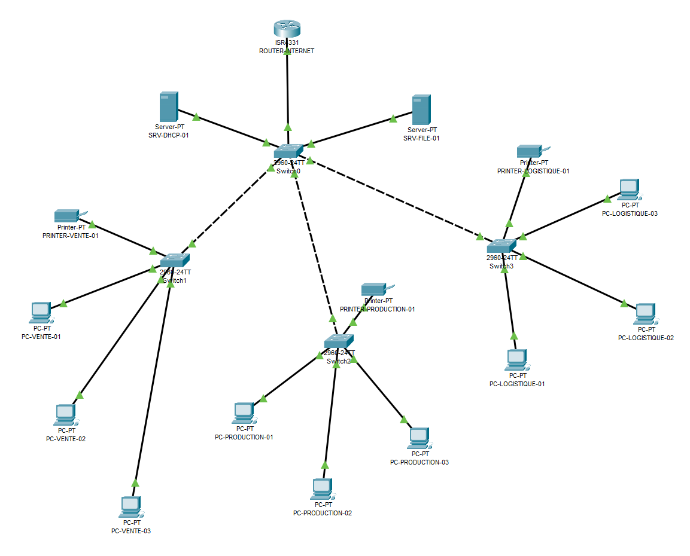

## 🧩 Plan d’adressage IP

| Périphérique         | Adresse IP           | Hostname                 | Rôle/Fonction                  | Adresse MAC      | Emplacement            |
|----------------------|----------------------|--------------------------|--------------------------------|------------------|------------------------|
| ISR4331              | 192.168.1.1          | ROUTER-INTERNET          | Accès Internet                 | 0006.2A91.E201   | Local Technique        |
| Server-PT            | 192.168.1.2          | SRV-DHCP-01              | DHCP / DNS / Active Directory  | 0010.1161.927C   | Local Technique        |
| Server-PT            | 192.168.1.3          | SRV-FILE-01              | Stockage / Partage             | 0030.F22A.B524   | Local Technique        |
| PC                   | 192.168.1.100–200    | PC-VENTE-01              | Poste utilisateur              | 0060.3E57.5C65   | Bureau des ventes      |
| Printer-PT           | 192.168.1.10         | PRINTER-VENTE-01         | Impression réseau              | 00E0.F737.48D9   | Bureau des ventes      |
| Printer-PT           | 192.168.1.13         | PRINTER-PRODUCTION-01    | Impression réseau              | 000D.BDD2.5974   | Bureau de production   |
| Printer-PT           | 192.168.1.16         | PRINTER-LOGISTIQUE-01    | Impression réseau              | 0060.4704.7550   | Bureau de la logistique|

